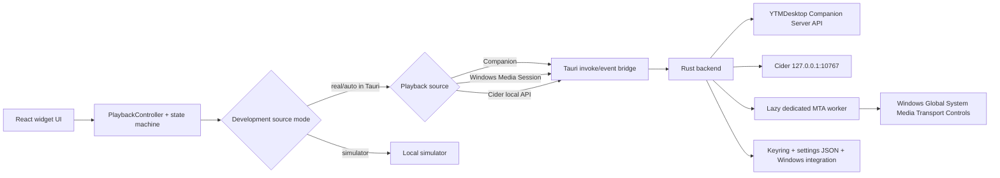

# Music Desktop Widget Architecture

## Goals

The widget is designed around four hard constraints:

- official playback integrations only: YTMDesktop Companion, Windows Media Session, or Cider's local API
- polished always-on-top desktop widget UX
- low idle overhead
- easy future extension for more window modes, locales, and platforms

## Layered structure

### App shell

- `src/app/AppRoot.tsx`
- `src/app/AppProvider.tsx`
- `src/app/WidgetWindow.tsx`
- `src/app/SettingsWindow.tsx`

Responsibilities:

- bootstrapping settings and runtime mode
- choosing the user-facing production source independently from the development simulator override
- wiring theme, i18n, and window-specific UI
- exposing a simple app model to components

### Playback domain

- `src/domain/playback/types.ts`
- `src/domain/playback/connectionMachine.ts`
- `src/domain/playback/controller.ts`
- `src/domain/playback/mapping.ts`
- `src/domain/playback/progress.ts`

Responsibilities:

- explicit connection state machine
- source snapshot to UI-state mapping with explicit capabilities
- reconnect scheduling with backoff
- progress smoothing between realtime updates
- stable command surface for UI components

### Integration layer

- Real gateway: `src/integration/companion/realGateway.ts`
- Windows Media gateway: `src/integration/windowsMedia/windowsMediaGateway.ts`
- Cider gateway: `src/integration/cider/ciderGateway.ts`
- Tauri invoke/event bridge: `src/integration/companion/tauriBridge.ts`
- Simulator gateway: `src/integration/simulator/simulatorGateway.ts`

Responsibilities:

- keeping frontend code unaware of transport details
- separating runtime-only bridge concerns from UI/domain code
- providing a realistic simulator without replacing the real architecture

### Native backend

- `src-tauri/src/companion.rs`
- `src-tauri/src/cider.rs`
- `src-tauri/src/settings.rs`
- `src-tauri/src/startup.rs`
- `src-tauri/src/windows_media.rs`
- `src-tauri/src/lib.rs`

Responsibilities:

- Companion API HTTP + realtime socket integration
- Cider loopback REST + shared application-wide Socket.IO integration
- current-session WinRT metadata, artwork, timeline, capability, and transport integration
- token storage via keyring
- settings persistence on disk
- tray integration and hide-to-tray behavior
- launch-on-startup on Windows
- window creation and position persistence

### UI components and visual system

- `src/components/**`
- `src/styles/global.css`
- `src/locales/en.json`
- `src/locales/ru.json`

Responsibilities:

- reusable glass panels, artwork layers, controls, and settings sections
- visual consistency across widget and settings windows
- externalized user-facing strings with matching English/Russian locale keys

## Runtime topology

## Connection model

The connection state machine exposes these explicit states:

- `disconnected`
- `discovering`
- `auth_required`
- `authenticating`
- `connected`
- `reconnecting`
- `error`

Why this matters:

- UI states stay intentional instead of stringly-typed
- reconnect logic is isolated from rendering
- simulator and real gateway can drive the same domain layer
- future telemetry and richer diagnostics can attach to the same transitions

## Real Companion flow

1. Frontend starts `PlaybackController`.
2. Controller asks the gateway whether stored auth exists.
3. Rust backend probes public `GET /metadata`.
4. If auth is missing, the UI moves to `auth_required`.
5. Auth uses `POST /api/v1/auth/requestcode` followed by `POST /api/v1/auth/request`.
6. If auth exists, Rust fetches `GET /api/v1/state` with the raw token in the `Authorization` header and opens the realtime socket.
7. Realtime connects to `/api/v1/realtime` over websocket with the token in `auth.token`.
8. Rust emits Companion events back to the frontend.
9. The controller maps raw Companion payloads into UI-ready playback snapshots.
10. Commands from the UI flow back through `POST /api/v1/command` with `{ command, data }` payloads.

## Simulator flow

The simulator exists for UI development, unit tests, and Playwright coverage.

Design rules:

- it implements the same `CompanionGateway` interface as the real client
- it emits realistic track changes and time progression
- it does not bypass the domain controller
- it is opt-in and clearly separated from production integration

## Windows Media Session flow

Delivery status: tasks `0050` and `0051` corrected the worker/runtime and isolated `E_ACCESSDENIED` to the restricted Codex sandbox token. Task `0052` then removed a separate transient attach failure: connect no longer waits for a complete current-session snapshot, live poll diagnostics survive the native/frontend boundary, and a failed poll reacquires the manager. The unpackaged path succeeds in the normal interactive Windows user session with Apple Music; package identity is not required, so [`task 0049`](project-tracking/tasks/0049-add-supported-packaged-wms-delivery.md) remains only an optional future installer/signing decision.

1. The persisted `playbackSource` selects `windowsMediaSession`; Companion remains the migration/default value.
2. The Rust adapter lazily starts one long-lived `std::thread`, initializes it with `RoInitialize(RO_INIT_MULTITHREADED)`, and sends typed requests through an actor queue.
3. Discovery and connection require manager access only. Session enumeration/current-session detail is best-effort, and connect commits before metadata, timeline, controls, or artwork are read.
4. Manager acquisition, session discovery, blocking WinRT futures, polling, metadata, timeline, artwork, and commands all execute sequentially on that worker rather than on the Tokio runtime.
5. A failed poll retains the previous snapshot, drops the stale manager, publishes a structured diagnostic, and retries manager/current-session acquisition on the next 750 ms worker cycle. A later successful poll restores the connected status.
6. The shared mapping layer produces the same `PlaybackSnapshot` contract used by Companion.
7. UI controls use capability flags rather than source-name checks.
8. WMS Like/Dislike/Mute are disabled and remain successful no-ops in both frontend and Rust as defense in depth.
9. Timeline values are normalized relative to `StartTime`, seek targets are clamped to `MinSeekTime`/`MaxSeekTime`, and polling waits 750 ms between unchanged snapshots rather than replaying missed async ticks in a burst.
10. Media text and raster artwork are bounded. Artwork is resolved once per track and omitted from subsequent state events so base64 data is not repeatedly copied through IPC.
11. Requests have a 15-second caller bound; cancelled connects are not committed, and disconnect/source switching clears the worker's manager, consumer handle, snapshot, and polling state.
12. The first poll publishes an explicit empty state, and field-level metadata/timeline/playback/control failures retain safe previous/default values without invalidating manager access.
13. Public errors stay generic while an optional diagnostic object preserves only stage, HRESULT, and category. Access denied produces localized guidance to launch the portable EXE directly in the normal interactive user session; the app never attempts to escape a restricted launcher.
14. Native WMS failures append only timestamp, operation, stage, category, and optional HRESULT to a 256 KiB rotating JSONL file under the app log directory. Logging is best-effort and never controls playback success.
15. No WMS media data is persisted in version 3.1.0.

## Cider flow

1. `playbackSource: cider` selects a dedicated gateway; it is not inferred through WMS.
2. Native discovery and REST calls are fixed to `http://127.0.0.1:10767`; remote/LAN endpoints are intentionally rejected by design.
3. Settings accepts a Cider external-application token, validates it against `playback/now-playing`, and stores it in Windows Credential Manager under a Cider-specific account.
4. The adapter fetches the initial `/api/v1/playback/now-playing` state, listens for Socket.IO `API:Playback` events, and maps bounded fields into the shared playback contract.
5. Supported transport, seek, and rating actions use `/api/v1/playback/*`; mute remains disabled rather than guessing at a volume restore value.
6. Main and Settings controllers reuse one live native socket. Intentional disconnect/replacement invalidates the lifecycle before close so it cannot publish a false global transport failure; a genuine close is published once.

## Settings and persistence

Settings are grouped by feature area:

1. Playback Source
2. API / Connection (Companion only)
3. UI / Display
4. Widget Layout
5. Widget Size
6. Transparency / Background
7. Window / Behavior
8. Developer controls
9. About

Persistence model:

- Tauri runtime: JSON settings in the app config directory
- browser preview: `localStorage`
- auth token: OS keyring through Rust, not in frontend storage
- locale: persisted as part of UI settings; English is the backward-compatible default
- widget size: persisted as a named mode plus one canonical Custom percentage; custom width and height are derived views of that percentage
- widget layout: persisted as a normalized permutation of six typed block IDs plus explicit visibility modes; unknown/duplicate IDs are repaired and missing IDs are appended
- Settings disclosure state: persisted as a deduplicated whitelist of top-level section IDs
- playback source: persisted separately from the development `sourceMode`; existing settings migrate to `companion`
- WMS diagnostics: bounded rotating JSONL in the native app log directory; no title, artist, artwork, source-app identity, credential, token, or command payload

## Version model

- `package.json` is the only manually edited application-version source.
- Tauri resolves `version` through `../package.json`.
- React imports the root package version for Settings/About display.
- Rust Companion metadata uses `CARGO_PKG_VERSION`.
- `npm run version:sync` updates required Cargo and lockfile copies; `npm run version:check` is part of `npm run verify`.

## Window model

### Main widget window

- frameless
- transparent
- canonical 336 px cover-driven layout with Compact, unchanged Default, Large, and linked Custom uniform scaling
- intrinsic content height is measured before the selected scale is applied to both the content layer and native window
- six primary blocks render through a persisted order while fallback/auth state cards remain outside the user-controlled order
- free border resize remains disabled; sizing is controlled through Settings
- always-on-top capable
- draggable on free surface
- hidden to tray on close

### Settings window

- separate window label
- opened on demand
- remembers its own position
- shares the same app model and visual language

## Performance notes

Performance-sensitive choices in the current implementation:

- expensive artwork styling only changes when artwork URLs change
- progress is smoothed locally instead of forcing constant transport updates
- simulator and transport logic are kept outside presentation components
- reconnect timing is handled in the controller instead of in React render paths
- the WMS worker starts only when WMS is first used and keeps blocking WinRT calls outside Tokio
- UI animation is mostly CSS-driven and short in duration

## Extensibility plan

The current structure is intentionally ready for:

- future alternate responsive/reflowing window layouts beyond the current proportional size modes
- optional free border resize if a later task defines safe persistence and aspect-ratio behavior
- additional locale JSON bundles beyond the current English/Russian pair
- Linux platform services and an official MPRIS/D-Bus adapter before macOS work
- GitHub CI/release automation for each supported native platform
- a scalable language picker and additional complete locale bundles
- macOS window, tray, startup, keychain, build, and signing behavior after the Linux/CI foundations
- richer diagnostics and logging around Companion reconnects
- enabling or disabling seek behavior with minimal UI churn

## Testing strategy

Current coverage focuses on the highest-value layers first:

- unit tests for connection-state transitions
- unit tests for Companion raw-state mapping
- unit tests for native Companion v2 request payload construction
- simulator behavior coverage
- widget rendering coverage for key states
- Playwright smoke flow for widget and settings views in simulator mode
- live Tauri MCP validation against a running debug app

## Development tooling note

The project is also wired for the Tauri MCP server named `tauri`, using the MCP bridge plugin in debug builds. Reference repo: <https://github.com/hypothesi/mcp-server-tauri>
