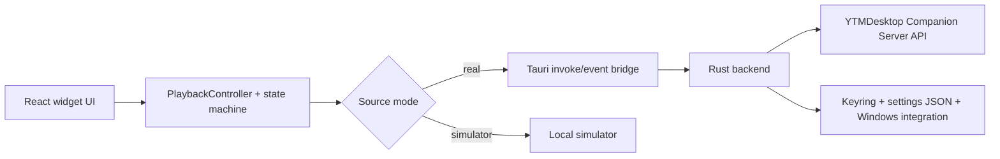

# Architecture

## Goals

The widget is designed around four hard constraints:

- Companion API only
- polished always-on-top desktop widget UX
- low idle overhead
- easy future extension for more window modes, locales, and platforms

## Layered structure

### App shell

- `src/app/AppRoot.tsx`
- `src/app/AppProvider.tsx`
- `src/app/WidgetWindow.tsx`
- `src/app/SettingsWindow.tsx`

Responsibilities:

- bootstrapping settings and runtime mode
- choosing real vs simulator gateway
- wiring theme, i18n, and window-specific UI
- exposing a simple app model to components

### Playback domain

- `src/domain/playback/types.ts`
- `src/domain/playback/connectionMachine.ts`
- `src/domain/playback/controller.ts`
- `src/domain/playback/mapping.ts`
- `src/domain/playback/progress.ts`

Responsibilities:

- explicit connection state machine
- Companion raw-state to UI-state mapping
- reconnect scheduling with backoff
- progress smoothing between realtime updates
- stable command surface for UI components

### Integration layer

- Real gateway: `src/integration/companion/realGateway.ts`
- Tauri invoke/event bridge: `src/integration/companion/tauriBridge.ts`
- Simulator gateway: `src/integration/simulator/simulatorGateway.ts`

Responsibilities:

- keeping frontend code unaware of transport details
- separating runtime-only bridge concerns from UI/domain code
- providing a realistic simulator without replacing the real architecture

### Native backend

- `src-tauri/src/companion.rs`
- `src-tauri/src/settings.rs`
- `src-tauri/src/startup.rs`
- `src-tauri/src/lib.rs`

Responsibilities:

- Companion API HTTP + realtime socket integration
- token storage via keyring
- settings persistence on disk
- tray integration and hide-to-tray behavior
- launch-on-startup on Windows
- window creation and position persistence

### UI components and visual system

- `src/components/**`
- `src/styles/global.css`
- `src/locales/en.json`
- `src/locales/ru.json`

Responsibilities:

- reusable glass panels, artwork layers, controls, and settings sections
- visual consistency across widget and settings windows
- externalized user-facing strings with matching English/Russian locale keys

## Runtime topology

## Connection model

The connection state machine exposes these explicit states:

- `disconnected`
- `discovering`
- `auth_required`
- `authenticating`
- `connected`
- `reconnecting`
- `error`

Why this matters:

- UI states stay intentional instead of stringly-typed
- reconnect logic is isolated from rendering
- simulator and real gateway can drive the same domain layer
- future telemetry and richer diagnostics can attach to the same transitions

## Real Companion flow

1. Frontend starts `PlaybackController`.
2. Controller asks the gateway whether stored auth exists.
3. Rust backend probes public `GET /metadata`.
4. If auth is missing, the UI moves to `auth_required`.
5. Auth uses `POST /api/v1/auth/requestcode` followed by `POST /api/v1/auth/request`.
6. If auth exists, Rust fetches `GET /api/v1/state` with the raw token in the `Authorization` header and opens the realtime socket.
7. Realtime connects to `/api/v1/realtime` over websocket with the token in `auth.token`.
8. Rust emits Companion events back to the frontend.
9. The controller maps raw Companion payloads into UI-ready playback snapshots.
10. Commands from the UI flow back through `POST /api/v1/command` with `{ command, data }` payloads.

## Simulator flow

The simulator exists for UI development, unit tests, and Playwright coverage.

Design rules:

- it implements the same `CompanionGateway` interface as the real client
- it emits realistic track changes and time progression
- it does not bypass the domain controller
- it is opt-in and clearly separated from production integration

## Settings and persistence

Settings are grouped by feature area:

1. API / Connection
2. UI / Display
3. Widget Layout
4. Widget Size
5. Transparency / Background
6. Window / Behavior
7. Developer controls
8. About

Persistence model:

- Tauri runtime: JSON settings in the app config directory
- browser preview: `localStorage`
- auth token: OS keyring through Rust, not in frontend storage
- locale: persisted as part of UI settings; English is the backward-compatible default
- widget size: persisted as a named mode plus one canonical Custom percentage; custom width and height are derived views of that percentage
- widget layout: persisted as a normalized permutation of six typed block IDs plus explicit visibility modes; unknown/duplicate IDs are repaired and missing IDs are appended
- Settings disclosure state: persisted as a deduplicated whitelist of top-level section IDs

## Version model

- `package.json` is the only manually edited application-version source.
- Tauri resolves `version` through `../package.json`.
- React imports the root package version for Settings/About display.
- Rust Companion metadata uses `CARGO_PKG_VERSION`.
- `npm run version:sync` updates required Cargo and lockfile copies; `npm run version:check` is part of `npm run verify`.

## Window model

### Main widget window

- frameless
- transparent
- canonical 336 px cover-driven layout with Compact, unchanged Default, Large, and linked Custom uniform scaling
- intrinsic content height is measured before the selected scale is applied to both the content layer and native window
- six primary blocks render through a persisted order while fallback/auth state cards remain outside the user-controlled order
- free border resize remains disabled; sizing is controlled through Settings
- always-on-top capable
- draggable on free surface
- hidden to tray on close

### Settings window

- separate window label
- opened on demand
- remembers its own position
- shares the same app model and visual language

## Performance notes

Performance-sensitive choices in the current implementation:

- expensive artwork styling only changes when artwork URLs change
- progress is smoothed locally instead of forcing constant transport updates
- simulator and transport logic are kept outside presentation components
- reconnect timing is handled in the controller instead of in React render paths
- UI animation is mostly CSS-driven and short in duration

## Extensibility plan

The current structure is intentionally ready for:

- future alternate responsive/reflowing window layouts beyond the current proportional size modes
- optional free border resize if a later task defines safe persistence and aspect-ratio behavior
- additional locale JSON bundles beyond the current English/Russian pair
- future macOS window behavior work
- richer diagnostics and logging around Companion reconnects
- enabling or disabling seek behavior with minimal UI churn

## Testing strategy

Current coverage focuses on the highest-value layers first:

- unit tests for connection-state transitions
- unit tests for Companion raw-state mapping
- unit tests for native Companion v2 request payload construction
- simulator behavior coverage
- widget rendering coverage for key states
- Playwright smoke flow for widget and settings views in simulator mode
- live Tauri MCP validation against a running debug app

## Development tooling note

The project is also wired for the Tauri MCP server named `tauri`, using the MCP bridge plugin in debug builds. Reference repo: <https://github.com/hypothesi/mcp-server-tauri>
